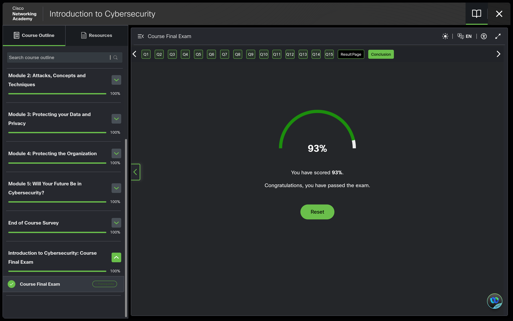
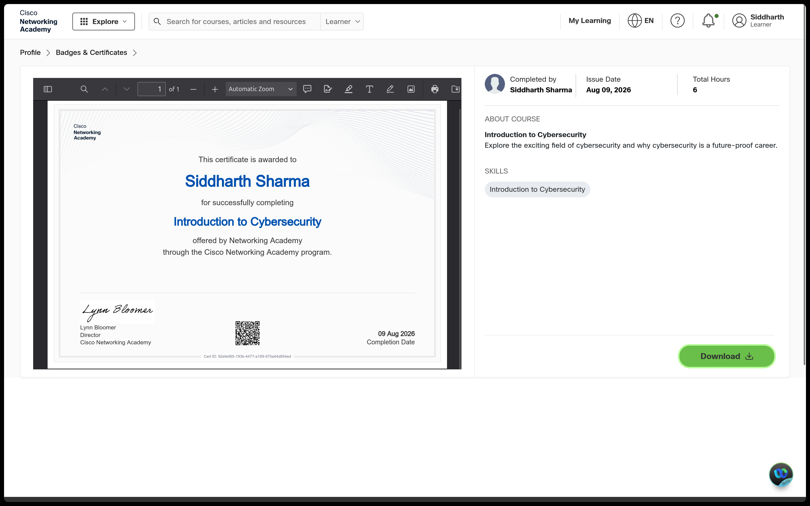
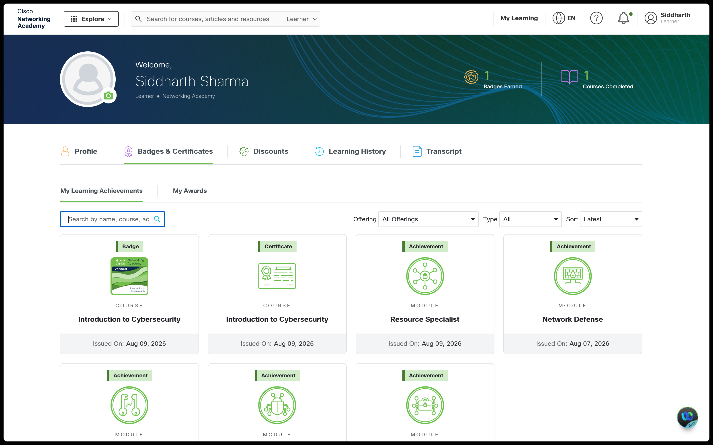

# SOC Analyst L1 Portfolio

**Siddharth Sharma** · [GitHub](https://github.com/sid-e-fi/) · [Portfolio](https://sid-e-fi.github.io/) · [LinkedIn](https://www.linkedin.com/in/13sidd/) · [er.sharma.sid@gmail.com](mailto:er.sharma.sid@gmail.com)

I'm working toward a SOC Analyst L1 role, and this repository is where that work gets documented as it happens — not a resume claim, an actual running record. It holds my security fundamentals notes, networking notes, lab documentation, and weekly progress, structured so it can be followed week by week rather than dumped all at once.

Every claim here is backed by something: a command output, a dated screenshot, or an explicit note that it hasn't been verified yet. The reasoning and the wrong turns are left in rather than polished away, because how an analyst reaches a conclusion matters more than the conclusion.

**Current state:** Weeks 1–2 complete · 29 concept notes · 6 lab writeups · 109-term glossary · 27 evidence screenshots

---

## Repository Structure

| Path | What's there |
|---|---|
| [`notes/security-fundamentals/`](notes/security-fundamentals/) | 15 concept notes — CIA triad, risk management, malware & social engineering, incident response, IAM, identity attacks, defense in depth, threat actors, vulnerabilities & patch management, network security |
| [`notes/networking/`](notes/networking/) | 14 concept notes — IP addressing, subnetting & CIDR, routing & segmentation, DHCP & DNS, ports & protocols, OSI model, packets & frames, topologies, LAN, command-line troubleshooting |
| [`labs/week-1-lab-setup/`](labs/week-1-lab-setup/) | Lab environment build — workspace organization, VMware setup, Windows 11 VM configuration |
| [`labs/week-2-networking/`](labs/week-2-networking/) | Hands-on networking labs — TryHackMe module work, lab network architecture, DNS/HTTP observation and layered troubleshooting |
| [`progress/`](progress/) | Reviewed, portfolio-facing weekly summaries — what was built, what was learned, what's still unclear |
| [`glossary.md`](glossary.md) | Living glossary, 109 terms, each with a SOC-relevance note and cross-links to the notes that use it |
| [`assets/`](assets/) | Evidence screenshots referenced throughout the docs above |

---

## Selected Work

Four pieces that show the most, regardless of which week they came from.

### [Home Lab Network Diagram](notes/networking/home-lab-network-diagram.md)

A Cisco Packet Tracer topology of my actual lab, not a textbook example — home router through Ubuntu host through the VMware NAT network to the Windows 11 VM, with the physical and virtual layers deliberately separated. The addressing in it was confirmed by running `ipconfig /all` and pinging four destinations from the VM (host-side interface, NAT gateway, physical router, external IP) before anything was drawn.

Full evidence and command output: [Lab Network Architecture](labs/week-2-networking/lab-network-architecture.md).

### [Incident Response](notes/security-fundamentals/incident-response.md)

The full IR lifecycle (Prepare → Detect/Analyze → Contain → Eradicate → Recover → Lessons Learned), walked through against a worked incident timeline — phishing email, credential theft, suspicious login, account disabled, endpoint isolated, persistence removed, credentials reset, system restored — including what an L1 analyst actually owns at each stage.

### [Ports & Protocols](notes/networking/ports-and-protocols.md)

Nine SOC-relevant ports (22, 53, 80, 443, 3389, 445, 25, 110, 143) and what each is commonly — but not definitively — associated with. The point of the note is that a port number is context, not a verdict: traffic direction changes the read entirely, and a routine-looking DNS query still warrants follow-up on the domain, frequency, and source process.

### [Network Commands & Troubleshooting](notes/networking/network-commands-and-troubleshooting.md)

Diagnostics as a layered process — local config, then IP reachability, then DNS, then TCP, then TLS, then the application — with a specific command mapped to each layer and a clear statement of what it proves versus merely suggests. Written out of two real troubleshooting calls: not declaring an outage when a first ping returned 100% loss and a third returned 0%, and working out why Windows `nslookup` returned `google.com.localdomain` until a trailing dot forced the FQDN.

---

## Credentials

**Cisco Introduction to Cybersecurity** — completed all 5 modules, final exam scored 93%. Certificate and Credly badge issued. Course notes: [Cisco Introduction to Cybersecurity](notes/security-fundamentals/cisco-introduction-to-cybersecurity-course-notes.md).

**TryHackMe** — completed the Pre Security networking module set (What Is Networking?, Intro to LAN, OSI Model, Packets & Frames, Extending Your Network) plus the Topic Transition Recap, earning 48 points. Hands-on exercises covered ICMP ping, the TCP three-way handshake, and port connectivity. Writeup: [Day 10 TryHackMe Networking Labs](labs/week-2-networking/day-10-tryhackme-networking-lab.md).

---

## Weekly Progress

| Week | Focus | Summary |
|---|---|---|
| 1 | Lab environment build + security fundamentals — CIA triad, risk management, malware & social engineering, IAM, incident response, Cisco course | [Week 1 Summary](progress/week-1-summary.md) |
| 2 | Networking fundamentals — addressing, subnetting, routing, DHCP/DNS, ports & protocols, OSI model, real lab network mapping, layered troubleshooting | [Week 2 Summary](progress/week-2-summary.md) |

Each summary records what was built, what was learned, what was initially misunderstood and how it got corrected, and what's still weak going into the next week.

---

## Environment

The hands-on work in this portfolio runs on a Windows 11 virtual machine under VMware Workstation Pro, hosted on Ubuntu. Virtualizing the Windows side means it can be configured, broken, and rebuilt for log generation and Windows administration practice, and later for SIEM and Active Directory labs, without touching the host system.

**VM configuration:** 4 vCPUs, 4 GB RAM, 64 GB virtual disk, NAT networking, UEFI firmware with TPM enabled. RAM was originally planned at 8 GB but scaled down after the host became noticeably less responsive; full reasoning and setup steps are in [`labs/week-1-lab-setup/vmware-setup.md`](labs/week-1-lab-setup/vmware-setup.md).

Before installing any lab software, a snapshot named **Win-Lab** was taken as a clean recovery baseline. If a future experiment breaks the environment, it can be rolled back to this point instead of reinstalling Windows from scratch.

**Network layout**, confirmed by command output rather than assumed:

| Component | Address |
|---|---|
| Home router | `192.168.1.1` |
| Ubuntu host (physical LAN) | `192.168.1.24` |
| VMware VMnet8 host-side interface | `192.168.27.1` |
| VMware NAT gateway | `192.168.27.2` |
| Windows 11 VM | `192.168.27.128/24` |

These are RFC 1918 private addresses on a disposable VM, published deliberately so the diagram and the lab writeups can be checked against each other.

---

## Roadmap

**Done:**

- ✅ **Week 1** — Lab environment setup + security fundamentals (CIA triad, risk management, malware & social engineering, incident response, IAM, threat actors, Cisco Introduction to Cybersecurity course)
- ✅ **Week 2** — Networking fundamentals (IP addressing, subnetting & CIDR, routing & segmentation, DHCP & DNS, ports & protocols, OSI model, topologies, real lab network mapping, layered command-line troubleshooting)

**Planned:**

- ⬜ Linux fundamentals
- ⬜ Windows fundamentals
- ⬜ Log analysis
- ⬜ SIEM
- ⬜ Detection engineering
- ⬜ MITRE ATT&CK
- ⬜ Threat intelligence
- ⬜ Incident reports (hands-on)
- ⬜ SOC labs
- ⬜ Projects

This list will grow and get more specific as each area is actually started — sections get added here once there's real work behind them, not in advance.

---

Terms used throughout the notes are defined in the [Cybersecurity Glossary](glossary.md).
