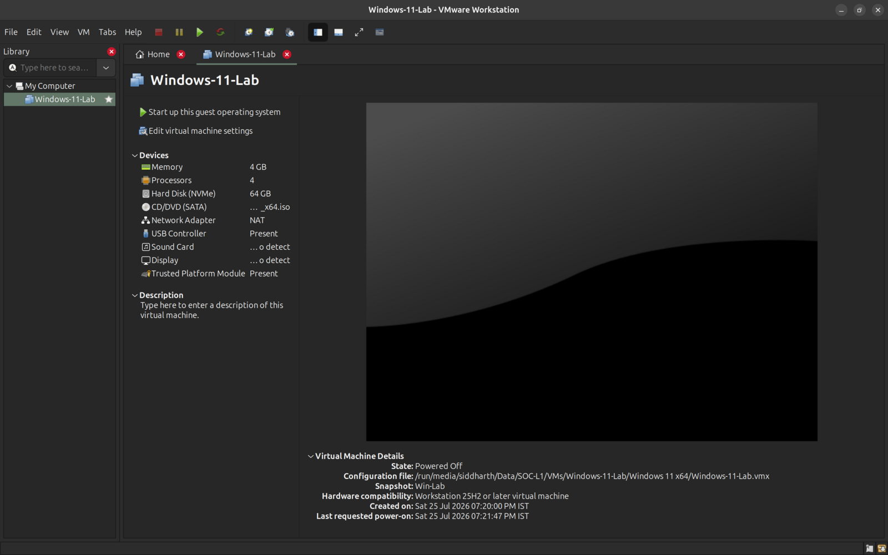
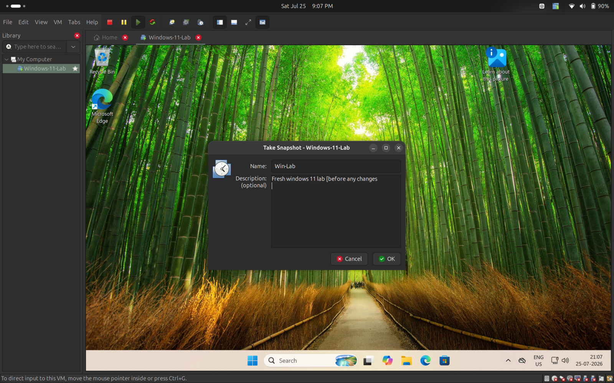

# SOC Analyst L1 Portfolio

**Siddharth Sharma** · [GitHub](https://github.com/sid-e-fi/) · [Portfolio](https://sid-e-fi.github.io/) · [LinkedIn](https://www.linkedin.com/in/13sidd/) · [er.sharma.sid@gmail.com](mailto:er.sharma.sid@gmail.com)

I'm working toward a SOC Analyst L1 role, and this repository is where that work gets documented as it happens — not a resume claim, an actual running record. It holds my security fundamentals notes, lab setup, and weekly progress, structured so it can be followed week by week rather than dumped all at once.

This is early-stage, in-progress work. I'm not presenting myself as an experienced analyst — I'm presenting the process of becoming one, with the reasoning and mistakes left in rather than polished away.

---

## Repository Structure

| Path | What's there |
|---|---|
| [`notes/security-fundamentals/`](notes/security-fundamentals/) | Core concept notes — CIA triad, risk management, malware & social engineering, incident response, IAM, network security, and more |
| [`glossary.md`](glossary.md) | A living glossary of cybersecurity terms, cross-linked to the notes that use them |
| [`labs/week-1-lab-setup/`](labs/week-1-lab-setup/) | Lab environment documentation — workspace organization, VMware setup, Windows 11 VM configuration |
| [`progress/week-1-summary.md`](progress/week-1-summary.md) | Reviewed, portfolio-facing weekly summary — what was built, what was learned, what's still unclear |
| [`assets/`](assets/) | Supporting screenshots referenced in the docs above |

---

## Week 1 Highlights

Week 1 covered lab environment setup plus the security fundamentals needed before moving into networking. Full writeup: [`progress/week-1-summary.md`](progress/week-1-summary.md).

A few notes worth reading directly:

- **[Incident Response](notes/security-fundamentals/incident-response.md)** — the full IR lifecycle (Prepare → Detect/Analyze → Contain → Eradicate → Recover → Lessons Learned), walked through against a worked incident timeline (phishing email → credential theft → suspicious login → account disabled → endpoint isolated → persistence removed → credentials reset → system restored), including what an L1 analyst actually owns in that process.
- **[Malware & Social Engineering](notes/security-fundamentals/malware-and-social-engineering.md)** — malware families and delivery methods, social engineering techniques, and how logs, alerts, and incidents relate as a SOC analyst investigates.
- **[Threat Actors & Cyber Warfare](notes/security-fundamentals/threat-actors-and-cyber-warfare.md)** — who performs attacks and why, and why attribution has to be evidence-based rather than assumed.

**Credential earned this week:** Cisco Introduction to Cybersecurity certificate and Credly badge, from completing the full 5-module course — see the [course notes](notes/security-fundamentals/cisco-introduction-to-cybersecurity-course-notes.md).

Also see the [Cybersecurity Glossary](glossary.md) for terms used throughout.

---

## Environment

The hands-on work in this portfolio runs on a Windows 11 virtual machine under VMware Workstation Pro, hosted on Ubuntu. Virtualizing the Windows side means it can be configured, broken, and rebuilt for log generation and Windows administration practice, and later for SIEM and Active Directory labs, without touching the host system.

**VM configuration:** 4 vCPUs, 4 GB RAM, NAT networking, UEFI firmware with TPM enabled, disk sized to comfortably hold the OS and lab tooling. RAM was originally planned at 8 GB but scaled down after the host became noticeably less responsive; full reasoning and setup steps are in [`labs/week-1-lab-setup/vmware-setup.md`](labs/week-1-lab-setup/vmware-setup.md).

Before installing any lab software, a snapshot named **Win-Lab** was taken as a clean recovery baseline. If a future experiment breaks the environment, it can be rolled back to this point instead of reinstalling Windows from scratch.

---

## Roadmap

**Done:**
- ✅ Week 1 — Lab environment setup + Security Fundamentals (CIA triad, risk management, malware & social engineering, incident response, IAM, Cisco Introduction to Cybersecurity course)

**Planned:**
- ⬜ Networking fundamentals (IPs, DNS, ports, protocols)
- ⬜ Linux fundamentals
- ⬜ Windows fundamentals
- ⬜ SIEM
- ⬜ Log analysis
- ⬜ Detection engineering
- ⬜ Incident reports (hands-on)
- ⬜ MITRE ATT&CK
- ⬜ SOC labs
- ⬜ Threat intelligence
- ⬜ Projects

This list will grow and get more specific as each area is actually started — sections get added here once there's real work behind them, not in advance.
