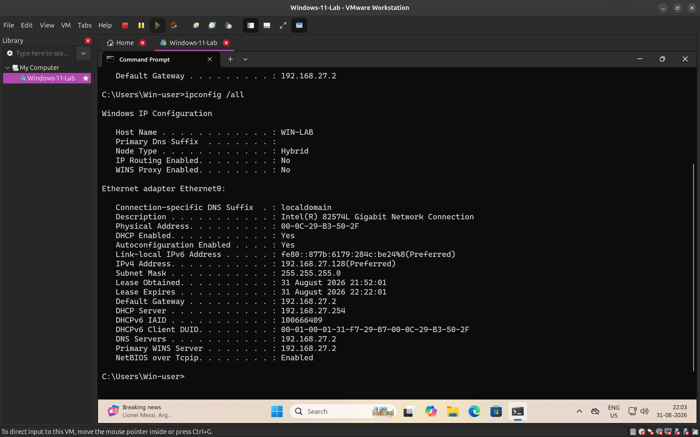
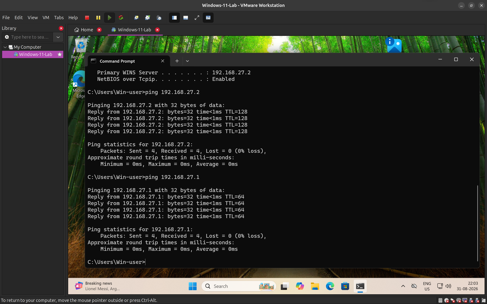
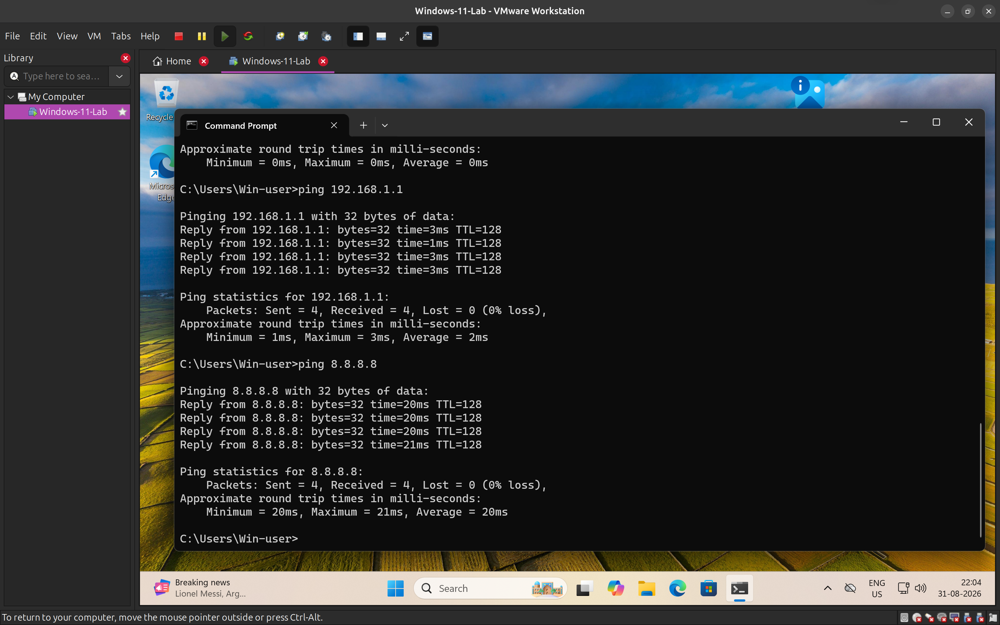
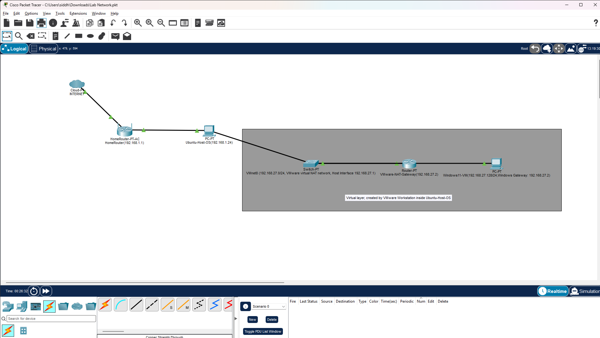

# Lab Network Architecture

# Purpose

Document the network architecture of my SOC home lab and map the relationship between the physical network, Ubuntu host, VMware virtual networking layer, and Windows 11 virtual machine.

The objective was to understand how a virtual machine connects to the host system and external networks, with particular focus on IP addressing, subnets, gateways, routing, and NAT.

This diagram also provides a reference for understanding where network traffic originates and which network boundaries it crosses.

# Environment

| Component | Details |
|---|---|
| Physical Router | Home router |
| Router IP | `192.168.1.1` |
| Host OS | Ubuntu |
| Host IP | `192.168.1.24` |
| Hypervisor | VMware Workstation |
| Virtual Network | VMware VMnet8 |
| Virtual Network Type | NAT |
| VMnet8 Host Interface | `192.168.27.1` |
| Windows 11 VM | Windows 11 Lab |
| Windows VM IP | `192.168.27.128` |
| Windows VM Gateway | `192.168.27.2` |
| Windows VM Subnet | `192.168.27.0/24` |



# Physical and Virtual Network Layers

The lab contains both physical and virtual networking components.

## Physical Network

```text
Internet
    |
    v
Home Router
192.168.1.1
    |
    v
Ubuntu Host
192.168.1.24
````

The Ubuntu system is physically connected to the home network and receives its network connectivity through the home router.

## Virtual Network

VMware Workstation creates an additional virtual networking layer inside the Ubuntu host.

```text
Ubuntu Host
192.168.1.24
    |
    v
VMware VMnet8
192.168.27.0/24
    |
    v
VMware NAT Gateway
192.168.27.2
    |
    v
Windows 11 VM
192.168.27.128
```

VMnet8 is a VMware NAT network. The Windows VM therefore belongs to a different IP subnet from the Ubuntu host's physical network.

## Ubuntu Host Verification

`ip addr` and `ip route` on the Ubuntu host confirm the addressing above directly: the physical Wi-Fi interface on `192.168.1.0/24`, and the `vmnet1` and `vmnet8` interfaces on their respective virtual subnets, each with a kernel route pointing back to the correct interface.


# Complete Network Path

The simplified architecture is:

```text
Internet
    |
    v
Home Router
192.168.1.1
    |
    v
Ubuntu Host
192.168.1.24
    |
    v
VMware VMnet8
192.168.27.0/24
    |
    v
VMware NAT Gateway
192.168.27.2
    |
    v
Windows 11 VM
192.168.27.128
```

For outbound communication from the Windows VM, the important path is:

```text
Windows VM
192.168.27.128
      |
      | Default Gateway
      v
VMware NAT Gateway
192.168.27.2
      |
      v
Ubuntu Host / Physical Network
192.168.1.24
      |
      v
Home Router
192.168.1.1
      |
      v
Internet
```

# Subnets

Two different IPv4 networks are involved.

## Physical Network

```text
Network:
192.168.1.0/24

Router:
192.168.1.1

Ubuntu Host:
192.168.1.24
```

## VMware NAT Network

```text
Network:
192.168.27.0/24

VMware NAT Gateway:
192.168.27.2

VMware Host Interface:
192.168.27.1

Windows VM:
192.168.27.128
```

The Windows VM and the Ubuntu host's physical interface are therefore **not on the same subnet**.

The Windows VM uses `192.168.27.2` as its default gateway because destinations outside `192.168.27.0/24` are considered remote from the VM's perspective.

# Connectivity Observations

The Windows VM was tested against several destinations.

## Windows VM to VMware NAT Gateway

```text
ping 192.168.27.2
```

Result:

```text
4 packets transmitted
4 packets received
0% packet loss
```

This demonstrates connectivity between the Windows VM and its VMware NAT gateway.

## Windows VM to VMware Host Interface

```text
ping 192.168.27.1
```

Result:

```text
4 packets transmitted
4 packets received
0% packet loss
```

This demonstrates that the Windows VM can communicate with the VMware host-side interface on the VMnet8 network.



## Windows VM to Physical Router

```text
ping 192.168.1.1
```

Result:

```text
4 packets transmitted
4 packets received
0% packet loss
```

The destination is outside the Windows VM's local subnet, so the traffic must be forwarded through the VM's default gateway.

## Windows VM to External IP

```text
ping 8.8.8.8
```

Result:

```text
4 packets transmitted
4 packets received
0% packet loss
```

This demonstrates successful outbound connectivity through the VMware NAT network and the physical network.



# Packet Forwarding Logic

The important concept is that a host first determines whether the destination is local or remote.

For example:

```text
Source:
192.168.27.128

Destination:
192.168.27.1
```

Both addresses belong to:

```text
192.168.27.0/24
```

Therefore, the destination is on the same subnet.

The Windows VM can communicate with it directly at the local network level without sending the packet to its default gateway.

However:

```text
Source:
192.168.27.128

Destination:
192.168.1.1
```

The destination belongs to a different subnet.

Therefore, Windows treats the destination as remote and sends the traffic toward its default gateway:

```text
192.168.27.128
      |
      v
192.168.27.2
      |
      v
192.168.1.1
```

# NAT

VMware's NAT configuration allows the Windows VM to access external networks without requiring the VM to appear directly on the physical home network.

The Windows VM uses:

```text
192.168.27.128
```

inside the VMware virtual network.

The VMware NAT mechanism handles communication between the virtual network and the external network.

This creates a logical separation between the VM network and the physical LAN.

# Packet Tracer Representation

Cisco Packet Tracer was used to create a visual representation of the architecture.

The Packet Tracer diagram represents the real environment conceptually.

It includes:

```text
Internet
    |
Home Router
    |
Ubuntu Host
    |
VMnet8
    |
VMware NAT Gateway
    |
Windows 11 VM
```

The grey area in the diagram represents the virtual networking layer created by VMware Workstation inside the Ubuntu host.



Packet Tracer does **not** reproduce the actual VMware implementation. It is being used as a network diagramming and visualization tool to represent the relationships between the components.

# SOC Relevance

Understanding this architecture is important when analysing network telemetry from virtualized systems.

A SOC analyst may encounter an event such as:

```text
Source:
192.168.27.128

Destination:
8.8.8.8

Port:
443
```

The analyst should understand that `192.168.27.128` belongs to the Windows VM and that the traffic originates from the virtual network.

The analyst should also understand that the visible source IP may represent an internal virtual address rather than a directly routable address on the physical LAN.

This matters when determining:

- Which host generated the traffic
- Which network segment the host belongs to
- Whether the destination is local or remote
- Which gateway should have handled the traffic
- Where NAT may affect the observed addresses
- How to correlate network activity with endpoint telemetry

The network diagram therefore provides useful context for future SIEM and network investigations.

# Security Considerations

The VMware NAT network provides a degree of network isolation for the Windows VM compared with placing the VM directly on the physical LAN.

However, NAT should not be treated as a security control by itself.

The VM can still communicate with external networks, and security monitoring is still required.

The lab should therefore be treated as a controlled environment for security experimentation.

# Documentation Evidence

## Packet Tracer Diagram

The completed Packet Tracer diagram documents:

- Physical network components
- Ubuntu host
- VMware VMnet8 network
- VMware NAT gateway
- Windows 11 VM
- IP addressing
- Subnet information
- Relationship between physical and virtual networking

The Packet Tracer file is maintained as the visual representation of the lab architecture.

# Lessons Learned

1. A host can participate in multiple networks through physical and virtual interfaces.
2. VMware VMnet8 creates a separate NAT network for the virtual machine.
3. The Windows VM and Ubuntu host's physical interface are on different subnets.
4. A default gateway is used when the destination is outside the local subnet.
5. NAT allows the Windows VM to communicate with external networks through the host's network connection.
6. Packet Tracer can be used to represent a real network architecture even when it cannot reproduce the underlying VMware implementation.
7. Network diagrams are useful investigation context because they show where an endpoint sits within the network.
8. An IP address alone is not enough to understand the full path or context of a network connection.

# Future Usage

This architecture will be referenced during later SOC labs involving:

- Windows telemetry
- Linux telemetry
- SIEM deployment
- Network connections
- Firewall events
- DNS activity
- Endpoint investigations
- Network-based alert triage

# Related Notes

- [Networking Fundamentals](../../notes/networking/networking-fundamentals.md)
- [Network Topologies](../../notes/networking/network-topologies.md)
- [Routing & Network Segmentation](../../notes/networking/routing-and-network-segmentation.md)
- [IP Addressing](../../notes/networking/ip-addressing.md)
- [Packets & Frames](../../notes/networking/packets-and-frames.md)
- [VMware Setup](../week-1-lab-setup/vmware-setup.md)
- [Windows 11 Lab](../week-1-lab-setup/windows-11-lab.md) 